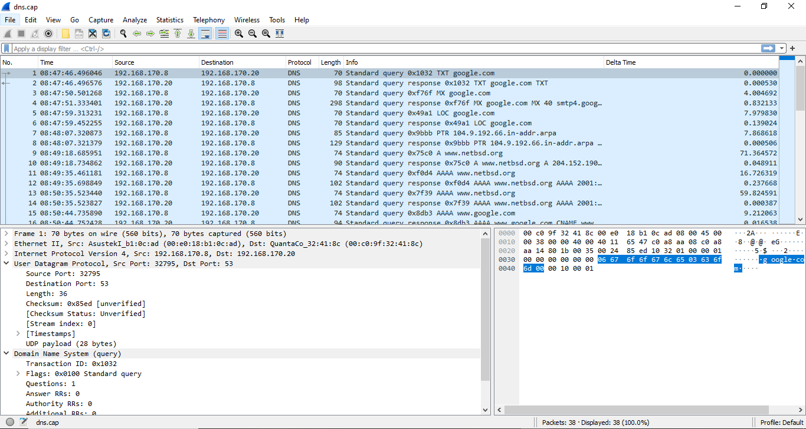
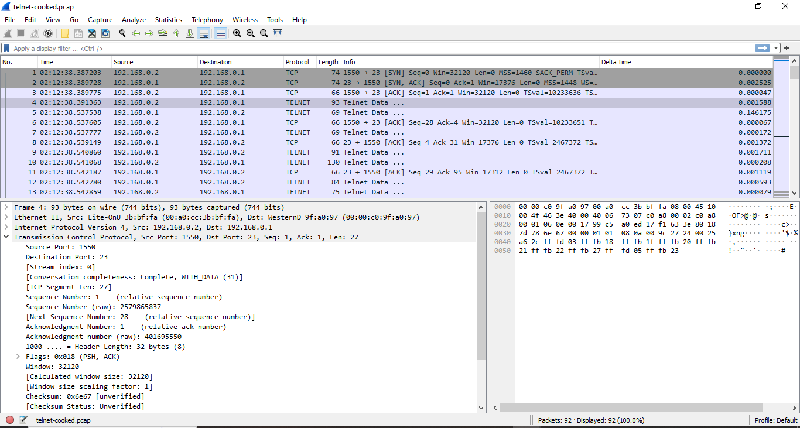

# ANALISIS DNS & TELNET CAP

    Nama		        : Diah Aulia Kusuma Putri
    NRP		            : 3122600008
    Kelas		        : 2 D4 IT A
    Mata Kuliah	        : Konsep Jaringan
    Dosen Pengampu	    : Dr. Ferry Astika Saputra S.T., M.Sc
    Pertemuan           : Minggu 1

## Domain Name System (DNS)

DNS (Domain Name System) adalah sistem yang digunakan untuk menghubungkan nama domain dengan alamat IP di jaringan komputer. Ini memungkinkan kita menggunakan nama domain yang mudah diingat, seperti www.detik.com, alih-alih harus mengingat alamat IP numerik yang rumit. Berikut adalah beberapa poin penting tentang DNS:

1. **Nama Domain**: Nama domain adalah alamat web yang lebih mudah diingat oleh manusia. Contohnya adalah google.com, facebook.com, atau cnn.com.

2. **Alamat IP**: Setiap perangkat yang terhubung ke internet memiliki alamat IP yang unik. Ini adalah alamat numerik yang digunakan oleh komputer untuk berkomunikasi satu sama lain.

3. **Fungsi DNS**: DNS berfungsi sebagai "buku telepon" internet. Ketika kita memasukkan nama domain (seperti www.example.com) dalam peramban web, DNS akan mencari alamat IP yang sesuai dengan nama tersebut.

4. **DNS Server**: Ada berbagai jenis server DNS, termasuk DNS root server, DNS authoritative server (server yang memiliki informasi resmi tentang nama domain tertentu), dan DNS recursive resolver (server yang menghubungkan pengguna ke server authoritative).

DNS sangat penting dalam fungsi dasar internet karena memungkinkan kita mengakses situs web, layanan online, dan perangkat jaringan dengan menggunakan nama yang lebih mudah diingat. Ini juga memungkinkan fleksibilitas dalam mengelola infrastruktur jaringan, karena nama domain dapat diarahkan ke alamat IP yang berubah-ubah sesuai kebutuhan.

### Analisis dns.cap pada wireshark

<strong>Gambar:</strong> dns.cap pada wireshark

Menganalisis alur lalu lintas pada dns.cap dengan Wireshark memungkinkan kita untuk memahami bagaimana komunikasi DNS terjadi di jaringan.

1. **Tampilan Utama** :
   Tampilan utama akan menampilkan daftar paket dalam file .cap. Setiap baris mewakili satu paket dalam komunikasi DNS. Berikut adalah beberapa kolom yang penting:

   - **No.**: Nomor urut paket.
   - **Time**: Waktu ketika paket ditangkap.
   - **Source**: Alamat IP sumber.
   - **Destination**: Alamat IP tujuan.
   - **Protocol**: Protokol yang digunakan, dalam kasus ini "DNS."
   - **Info**: Informasi tentang paket DNS, termasuk tipe permintaan, nama domain yang diminta, dan respons server.

2. **Filter DNS**:
   Jika daftar paket terlalu panjang, kita dapat menggunakan filter untuk fokus hanya pada paket DNS. Ketik "dns" di kotak pencarian di atas daftar paket untuk hanya menampilkan paket-paket DNS.

3. **Analisis Permintaan DNS**:

   - Dalam kolom "Info," kita dapat melihat tipe permintaan DNS seperti "Stkitard query A www.example.com." Ini menunjukkan permintaan untuk alamat IPv4 (DNS A Record) dari www.example.com.
   - kita akan melihat alamat IP sumber (client) yang melakukan permintaan DNS dan alamat IP tujuan (server DNS).

4. **Analisis Respon DNS**:

   - Di bawah permintaan DNS, kita akan melihat respons dari server DNS. Contohnya bisa seperti "Stkitard query response A 93.184.216.34." Ini adalah jawaban dari server DNS yang mengidentifikasi alamat IP yang sesuai dengan nama domain yang diminta.

5. **TTL (Time to Live)**:

   - Dalam respons DNS, kita akan melihat nilai TTL yang menunjukkan berapa lama hasil resolusi DNS akan disimpan dalam cache sebelum harus diperbarui.

6. **Perhatikan Pertukaran DNS**:

   - kita dapat melihat bagaimana permintaan dan respons DNS berhubungan satu sama lain dengan melihat nomor urut paket. Permintaan akan diikuti oleh respons yang sesuai.

7. **Pentingnya Waktu**:
   - kita juga bisa melihat kolom "Time" untuk memeriksa waktu respon DNS. Ini dapat membantu kita memahami kinerja jaringan dan respon server DNS.

_**Dengan menganalisis alur lalu lintas pada file dns.cap di Wireshark, kita dapat melacak dan memahami bagaimana proses resolusi DNS berlangsung, termasuk permintaan dan respons, serta berapa lama hasilnya akan disimpan dalam cache. Hal ini sangat berguna dalam mendiagnosis masalah DNS atau memahami bagaimana jaringan kita berinteraksi dengan server DNS.**_

## Teletype Network (Telnet)

<strong>Gambar:</strong> telnet.cap pada wireshark

Menganalisis alur lalu lintas pada telnet-cooked.pcap dengan Wireshark memungkinkan kita untuk memahami bagaimana komunikasi DNS terjadi di jaringan.

1. **Paket-paket Telnet**: Dalam tampilan utama, kita akan melihat daftar paket yang ditangkap selama sesi Telnet. Setiap baris mewakili satu paket yang dikirimkan antara client dan server Telnet.

2. **Nomor Urut Paket**: Biasanya, kolom pertama adalah nomor urut paket. Ini membantu kita melacak urutan paket dalam sesi.

3. **Waktu**: Kolom kedua adalah waktu ketika paket tersebut ditangkap oleh Wireshark.

4. **Sumber dan Tujuan**: Kolom berikutnya adalah alamat IP sumber dan tujuan. Dalam kasus Telnet, ini akan menunjukkan alamat IP client dan server yang berkomunikasi.

5. **Protokol**: Kolom ini akan menunjukkan "Telnet" atau "TELNET" sebagai protokol yang digunakan.

6. **Info**: Kolom "Info" akan memberikan informasi tambahan tentang paket. kita dapat melihat perintah-perintah Telnet yang dikirim antara client dan server di sini.

7. **Panjang Paket**: Kolom ini menunjukkan panjang paket dalam byte.

_**Dalam lalu lintas Telnet, kita dapat melihat interaksi antara client dan server. Ini termasuk perintah-perintah yang dikirim oleh client (seperti login, perintah shell, dsb.) dan tanggapan dari server.**_

_**Penting untuk dicatat bahwa lalu lintas Telnet tidak aman secara default karena data yang dikirimkan antara client dan server tidak dienkripsi. Ini berarti jika kita membaca lalu lintas Telnet di Wireshark, kita mungkin akan melihat teks terbuka, termasuk kata sandi, perintah, dan informasi lainnya. Karena itu, sangat disarankan untuk tidak menggunakan Telnet untuk komunikasi yang sensitif.**_
