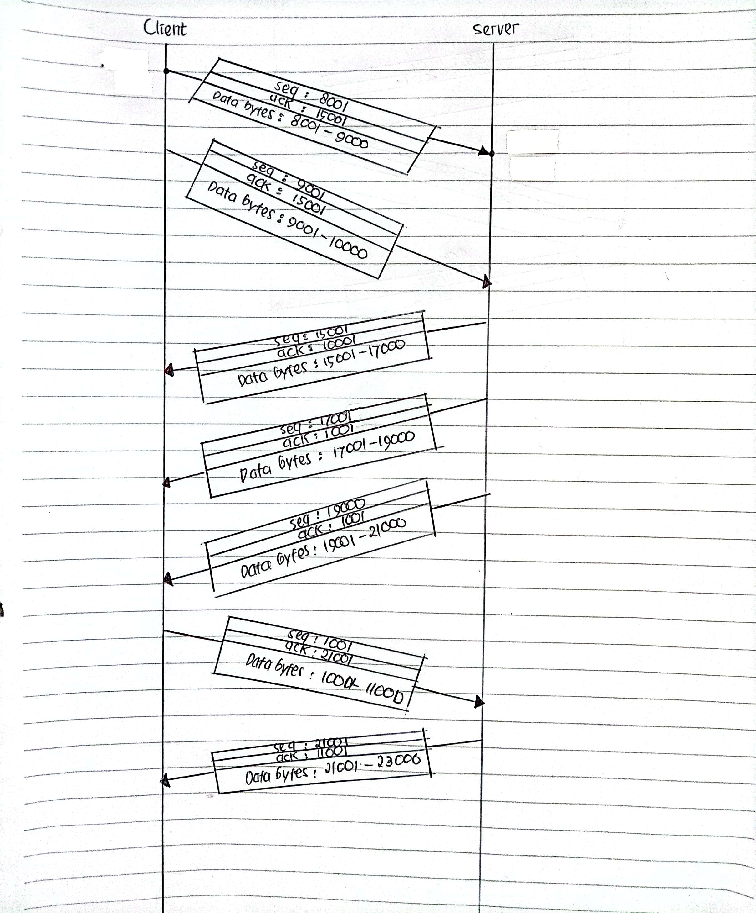
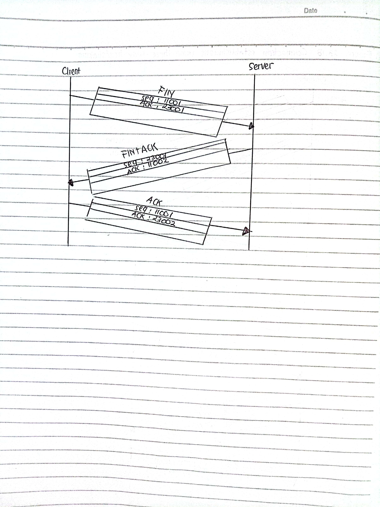

# KONSEP JARINGAN / 2 D4 IT A / 3122600008/ Praktikum Weeks 2

# 1. Data Transfer

<strong>Gambar:</strong> 1.1 data-transfer

### **Analisis :**

Proses transfer data antara client dan server dalam komunikasi jaringan menggunakan konsep "sequence" dan "acknowledgment" (ack) melibatkan beberapa tahapan.

**1. Proses Transfer Data dengan Sequence dan Acknowledgment**:

- **Client mengirim data ke Server**:

  1.  Client mengirim data ke server dalam bentuk paket data.
  2.  Setiap paket memiliki nomor urut (sequence number) yang unik. Ini membantu dalam pengaturan ulang data jika paket hilang atau tiba dalam urutan yang salah.
  3.  Server menerima paket dan mengirim ack (acknowledgment) kembali ke client. Ack ini berisi nomor urut paket selanjutnya yang diharapkan.

- **Server mengirim data ke Client**:

  1.  Server mengirim balasan atau data lainnya ke client dalam bentuk paket data.
  2.  Seperti sebelumnya, setiap paket memiliki nomor urut.
  3.  Client menerima paket dan mengirim ack kembali ke server, berisi nomor urut paket selanjutnya yang diharapkan.

- **Proses ini berlanjut hingga semua data telah ditransfer**.

- **Flow Control**: Selain itu, konsep ini juga dapat digunakan untuk mengontrol laju aliran data, di mana penerima (client atau server) dapat memberi tahu pengirim (server atau client) seberapa banyak data yang dapat mereka terima sekaligus.

## 2. Connection Termination (Penutupan Koneksi) menggunakan Three-Way Handshaking

<strong>Gambar:</strong>2.1 connection-termination

- Untuk menutup koneksi dengan aman, digunakan konsep "Three-Way Handshake". Proses ini melibatkan tiga langkah:

  1.  **Client mengirim FIN (Finish) ke Server**:

      - Client mengirimkan pesan FIN ke server, yang menunjukkan bahwa client telah selesai mengirim data.

  2.  **Server mengirim ACK (Acknowledgment) ke Client**:

      - Server menerima FIN dari client dan mengirimkan ACK sebagai konfirmasi. Ini menunjukkan bahwa server menerima permintaan penutupan koneksi dari client.

  3.  **Server mengirim FIN ke Client**:

      - Setelah server selesai mengirim data atau ingin menutup koneksi juga, server mengirimkan pesan FIN ke client.

  4.  **Client mengirim ACK ke Server**:
      - Client menerima FIN dari server dan mengirimkan ACK sebagai konfirmasi penutupan koneksi.

- Setelah langkah-langkah ini, koneksi dianggap ditutup dan tidak ada lagi data yang ditransfer di antara client dan server.

### Kesimpulan

_**Penggunaan nomor urut (sequence numbers) dalam komunikasi data dan penggunaan Three-Way Handshake dalam penutupan koneksi adalah teknik kunci dalam memastikan integritas data dan keamanan komunikasi jaringan. Ini memungkinkan pengirim dan penerima untuk saling memahami status dan mengatur ulang jika ada masalah dalam transfer data.**_
