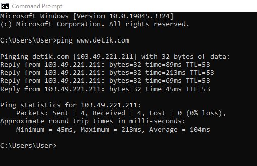
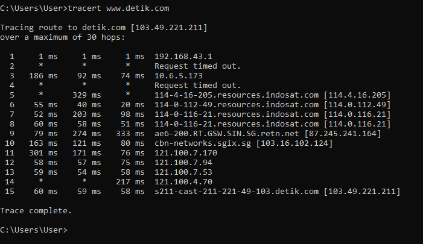

# KONSEP JARINGAN / 2 D4 IT A / 3122600008/ Praktikum Weeks 2

## Analisis Perintah Ping dan Trace Route Pada CMD

### 1. Ping

<strong>Gambar :</strong> 1.1 perintah ping

**Analisis**:

- Perintah `ping` digunakan untuk mengukur respons dan latensi (waktu respons) dari server atau situs web tertentu.
- Hasil dari perintah ini akan menunjukkan berapa lama waktu yang dibutuhkan (dalam milidetik) bagi paket data untuk mencapai server dan kembali ke komputeR.
- Dapat dilihat jumlah paket yang dikirim, jumlah paket yang diterima, serta statistik tentang waktu respons (min, max, avg).

**Cara Kerja Perintah Ping**:

- Ketika kita menjalankan `ping www.detik.com`, sistem kita akan mencari alamat IP yang sesuai dengan nama domain www.detik.com menggunakan DNS (Domain Name System).
- Setelah alamat IP ditemukan, komputer kita akan mengirim serangkaian paket data ke alamat IP tersebut.
- Server www.detik.com akan merespons dengan mengirim kembali paket-paket tersebut.
- Setiap paket yang kembali akan diukur waktu yang dibutuhkan untuk perjalanan ke server dan kembali, serta jika paket tersebut hilang atau tiba dalam kondisi yang buruk, ini juga akan dicatat.

### 2. Trace Route

<strong>Gambar :</strong> 2.1 perintah tracert

**Analisis** :

- Perintah `tracert` digunakan untuk melacak jalur yang diambil oleh paket data untuk mencapai tujuan tertentu, yaitu www.detik.com dalam contoh ini.
- Ini membantu kita memahami jalur yang dilalui data melalui berbagai node atau router di jaringan.
- Hasilnya akan menunjukkan alamat IP dan waktu respons dari setiap hop (node) yang dilalui.

**Cara Kerja Perintah Tracert** :

- Ketika kita menjalankan `tracert www.detik.com`, komputer kita akan mengirim paket data dengan TTL (Time-to-Live) yang berbeda ke tujuan www.detik.com.
- Setiap hop di jalur akan merespons dengan alamat IP dan waktu respons mereka ketika mereka menerima paket dengan TTL yang habis.
- Dengan cara ini, kita dapat memetakan jalur yang diambil oleh paket data dari komputer kita ke server www.detik.com.
