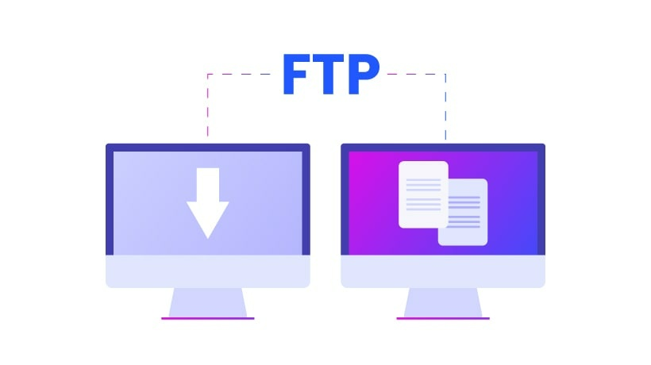
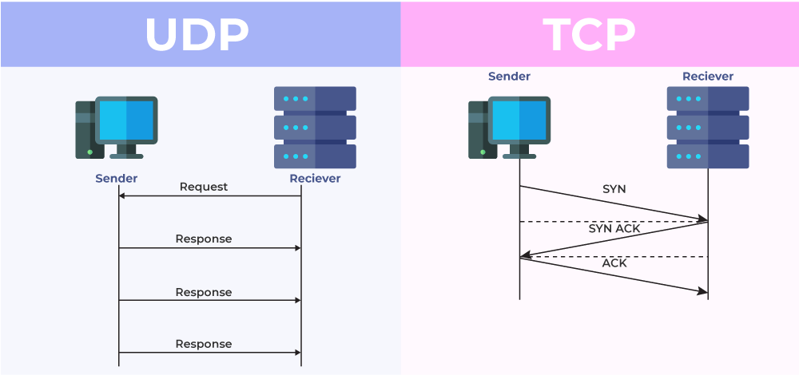

# KONSEP JARINGAN / 2 D4 IT A / 3122600008

# Tugas 1 : Mengapa 1 Port FTP Dapat Memakai TCP & UDP?

Port FTP (File Transfer Protocol) biasanya digunakan dengan protokol TCP (Transmission Control Protocol) karena TCP adalah protokol yang andal dan memiliki beberapa fitur yang sangat penting untuk transfer file, seperti pengiriman data yang terjamin dan pengendalian aliran data yang baik. Namun, dalam beberapa kasus tertentu, UDP (User Datagram Protocol) juga dapat digunakan dengan port FTP, meskipun ini bukanlah praktik yang umum.

Contoh kondisi penggunaan UDP pada port FTP adalah dalam situasi di mana pengiriman data FTP perlu dilakukan dengan latensi yang sangat rendah dan toleransi terhadap kerugian data yang dapat diterima. UDP tidak memiliki overhead yang sama dengan TCP dan tidak melakukan pengiriman ulang data yang hilang atau rusak. Oleh karena itu, UDP dapat lebih cepat daripada TCP dalam beberapa kasus.

### Ada beberapa alasan mengapa UDP jarang digunakan dalam konteks FTP

**Reliability**
UDP tidak menjamin pengiriman paket, sehingga tidak dapat diandalkan seperti TCP. Ini berarti jika paket data hilang atau rusak selama transmisi, tidak ada mekanisme otomatis untuk mengirim ulang atau memastikan integritas data. Hal ini menjadi masalah besar dalam transfer file yang memerlukan integritas data yang tinggi.

**Ordering**
UDP tidak memastikan bahwa paket data yang dikirimkan akan diterima dalam urutan yang benar. Dalam FTP, penting untuk menjaga urutan yang benar dari data yang dikirim dan diterima, yang dikelola secara otomatis oleh TCP.

**Flow Control**
UDP tidak memiliki mekanisme flow control seperti TCP, yang memungkinkan pengendalian laju transfer data sesuai dengan kemampuan penerima. Ini dapat mengakibatkan overloading dan masalah kinerja jika data dikirim terlalu cepat.

**Firewall dan NAT**
Penggunaan UDP pada port FTP dapat menyulitkan konfigurasi firewall dan Network Address Translation (NAT) karena tidak seperti TCP yang menggunakan koneksi dua arah yang mudah dilacak, UDP cenderung memerlukan aturan khusus untuk mengizinkan lalu lintas.

### Namun, ada beberapa alasan mengapa penggunaan TCP lebih tepat untuk port FTP dalam kebanyakan situasi

1. Keandalan: TCP menjamin pengiriman data yang dapat diandalkan. Ini berarti data yang dikirimkan akan sampai ke tujuannya dalam urutan yang benar dan tidak akan hilang atau rusak di jalan. Untuk transfer file yang kritis, ini sangat penting.

2. Kontrol Aliran: TCP memiliki mekanisme yang baik untuk mengendalikan aliran data, yang berarti transfer file tidak akan mengalami oversaturation atau kelebihan beban yang dapat merusak kinerja jaringan.

3. Handshake: TCP menggunakan tiga tahap tukar-menukar tangan (three-way handshake) untuk membuka koneksi, yang membantu memastikan bahwa komunikasi antara pengirim dan penerima dimulai dengan benar.

4. Acknowledgment: TCP mengharuskan penerima mengonfirmasi setiap segmen data yang diterima, sehingga pengirim tahu bahwa data telah diterima dengan benar. Ini memungkinkan pengirim untuk melakukan retransmisi jika diperlukan.

5. Pengiriman Data dalam Urutan: TCP memastikan bahwa data dikirimkan dalam urutan yang benar, yang sangat penting untuk aplikasi transfer file seperti FTP.

_Dengan demikian, meskipun ada situasi tertentu di mana UDP dapat digunakan dengan port FTP untuk kecepatan transfer yang lebih tinggi, penggunaan TCP tetap lebih disarankan karena fitur-fitur keandalan dan pengendalian yang dimilikinya, yang sangat penting untuk transfer file yang andal dan aman._
