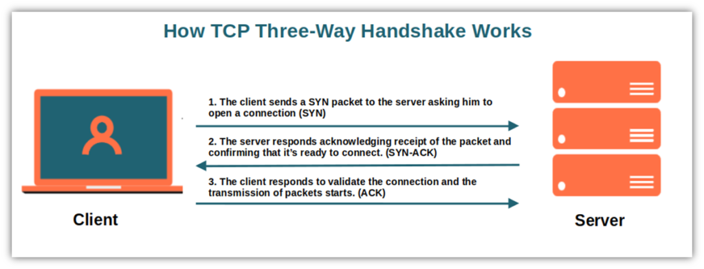

# KONSEP JARINGAN / 2 D4 IT A / 3122600008

# Tugas 2 : Apa itu Three Way Handshaking?

Three-way handshake (tiga langkah jabat tangan) adalah prosedur penting dalam koneksi TCP (Transmission Control Protocol) yang memungkinkan dua perangkat atau komputer untuk saling mengenali dan membuka koneksi jaringan. Ini adalah cara untuk memastikan bahwa kedua sisi koneksi siap berkomunikasi dengan benar. Mari kita jelaskan tiga langkah jabat tangan ini secara runtut agar mudah dipahami:

1. **Permintaan Koneksi (SYN)**:

   - Langkah pertama dimulai oleh komputer yang ingin memulai koneksi (biasanya disebut "klien").
   - Klien mengirimkan paket khusus yang disebut "SYN" (synchronize) ke komputer tujuan (biasanya disebut "server").
   - Paket SYN berisi nomor urut awal (initial sequence number) yang akan digunakan untuk mengidentifikasi data dalam koneksi ini. Nomor ini adalah angka acak yang akan digunakan dalam proses pertukaran data.
   - Klien juga menentukan nomor port yang akan digunakan untuk koneksi ini.

2. **Konfirmasi Koneksi (SYN + ACK)**:

   - Setelah menerima paket SYN dari klien, server mengirimkan balasan dengan paket khusus yang disebut "SYN-ACK".
   - Paket SYN-ACK berisi konfirmasi dari nomor urut awal yang diterima dari klien (ditambah satu), serta nomor urut awal server sendiri.
   - Server juga menentukan nomor port yang akan digunakan untuk koneksi ini.

3. **Konfirmasi Klien (ACK)**:
   - Terakhir, setelah klien menerima paket SYN-ACK dari server, klien mengirimkan konfirmasi terakhir dalam bentuk paket "ACK" (acknowledgment).
   - Paket ACK mengkonfirmasi bahwa klien telah menerima SYN-ACK dari server.
   - Setelah server menerima ACK ini, koneksi dianggap telah didirikan, dan keduanya siap untuk saling bertukar data.

_Sekarang, kedua belah pihak telah mengidentifikasi satu sama lain, menyepakati nomor urut awal, dan memastikan koneksi berfungsi dengan baik. Mereka dapat mulai bertukar data dalam dua arah melalui koneksi TCP ini. Jika ada gangguan atau masalah dalam proses jabat tangan tiga langkah ini, koneksi akan ditolak, dan komunikasi tidak akan dimulai._

_Ini adalah cara dasar tiga langkah jabat tangan bekerja dalam TCP untuk memastikan komunikasi yang andal antara dua perangkat dalam jaringan._
