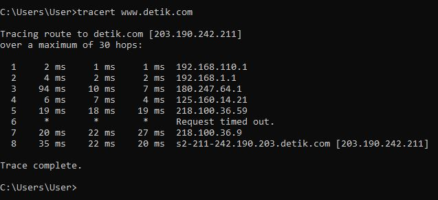

    Nama            : Diah Aulia Kusuma Putri
    NRP             : 3122600008
    Kelas           : 2 D4 IT A
    Mata Kuliah     : Konsep Jaringan
    Dosen Pengampu  : Dr. Ferry Astika Saputra S.T., M.Sc
    Pertemuan       : Minggu 8

# PENJELASAN PING & TRACERT

## 1. Tracer Route (Tracert)

### 1.1 Penjelasan Tracert

Tracert adalah alat untuk melihat rute atau jalan yang digunakan oleh data ketika dikirim melalui internet. Saat Anda mengunjungi sebuah situs web, data Anda melewati beberapa perangkat jaringan. Tracert membantu Anda melihat daftar perangkat ini dan berapa lama data Anda sampai ke masing-masing perangkat. Ini membantu mengidentifikasi masalah jika ada koneksi lambat atau masalah lain dengan situs web atau layanan online yang Anda gunakan. Jadi, Tracert adalah alat untuk memahami perjalanan data Anda melalui internet.

### 1.2 Analisis Tiap Kolom Tracert

- **Hop (Lompatan):** Ini adalah nomor lompatan atau hop dalam perjalanan paket data dari komputer Anda ke tujuan (detik.com). Setiap lompatan mewakili perangkat jaringan atau router yang dilewati oleh paket data saat mencapai tujuan.

- **Waktu (Latency):** Ini adalah waktu yang diperlukan untuk paket data mencapai setiap hop dalam milidetik (ms). Waktu ini mencakup total waktu yang diperlukan untuk mengirim paket ke hop tersebut dan menerima responsnya. Waktu yang lebih rendah biasanya lebih baik, karena menunjukkan koneksi yang lebih cepat.

- **IP Address (Alamat IP):** Ini adalah alamat IP dari setiap hop atau perangkat jaringan yang dilewati. Ini adalah alamat IP dari router atau server di masing-masing lompatan. Anda dapat melihat alamat IP ini untuk melacak perangkat yang dilewati oleh paket.

## 2. Percobaan Ping & Tracert

### 2.1 Ping www.detik.com

<strong>Gambar:</strong> Pinging www.detik.com

Hasil perintah `ping www.detik.com` menunjukkan informasi tentang koneksi ke situs web www.detik.com. Berikut adalah output ping tersebut:

- **Pinging detik.com [203.190.242.211] with 32 bytes of data**: Ini menunjukkan bahwa perintah ping sedang mencoba menghubungkan ke situs web detik.com yang dikenali dengan alamat IP 203.190.242.211. Ukuran paket yang dikirim adalah 32 byte.

- **Reply from 203.190.242.211: bytes=32 time=21ms TTL=56**: Ini adalah respon dari server detik.com. Waktu yang diperlukan untuk data pergi dari komputer Anda ke server detik.com adalah 21 milidetik (ms). TTL (Time to Live) adalah 56, yang menunjukkan bahwa paket data tersebut bisa melakukan 56 hop (loncatan) sebelum dianggap kadaluarsa.

- **Ping statistics for 203.190.242.211**: Ini adalah statistik hasil dari pengujian ping ke server detik.com.

  - **Packets: Sent = 4, Received = 4, Lost = 0 (0% loss)**: Ini menunjukkan bahwa Anda telah mengirim 4 paket ping ke server detik.com, dan semuanya diterima dengan sukses tanpa ada yang hilang (0% packet loss). Ini adalah tanda koneksi yang baik.

  - **Approximate round trip times in milli-seconds**:
    - **Minimum = 21ms**: Waktu tercepat dalam milidetik (21 ms) yang diperlukan untuk mencapai server detik.com.
    - **Maximum = 45ms**: Waktu terlama dalam milidetik (45 ms) yang diperlukan untuk mencapai server detik.com.
    - **Average = 30ms**: Rata-rata waktu dalam milidetik (30 ms) yang diperlukan untuk mencapai server detik.com.

**_Hasil ping menunjukkan bahwa koneksi ke server detik.com adalah baik dengan respons cepat. Tidak ada paket yang hilang, dan rata-rata waktu perjalanan paket data adalah 30 ms, dengan waktu terlama sekitar 45 ms dan waktu tercepat sekitar 21 ms. Hal ini menunjukkan koneksi yang andal dan cepat ke server detik.com._**

### 2.2 Tracert www.detik.com

<strong>Gambar:</strong> Tracert www.detik.com

Dalam analisis tracert ini, paket data telah melewati hop sebelum mencapai tujuan di server www.detik.com. Di bawah adalah analisis singkat setiap hop:

**Hop 1** - 192.168.110.1: Ini adalah alamat IP dari router lokal Anda.

**Hop 2** - 192.168.1.1: Ini adalah alamat IP dari router pertama setelah router lokal Anda.

**Hop 3** - 180.247.64.1: Ini adalah alamat IP dari router berikutnya dalam rute.

**Hop 4** - 125.160.14.21: Alamat IP dari router berikutnya.

**Hop 5** - 218.100.36.59: Ini adalah alamat IP dari hop berikutnya dalam rute.

**Hop 6** - Permintaan waktu habis. Ini berarti bahwa router di hop ini tidak merespons permintaan traceroute, dan karenanya, waktu tidak dapat diukur.

**Hop 7** - 218.100.36.9: Alamat IP dari hop berikutnya yang merespons permintaan traceroute.

**Hop 8** - s2-211-242.190.203.detik.com [203.190.242.211]: Ini adalah alamat IP akhir, yaitu tujuan akhir (detik.com) yang dicari.
